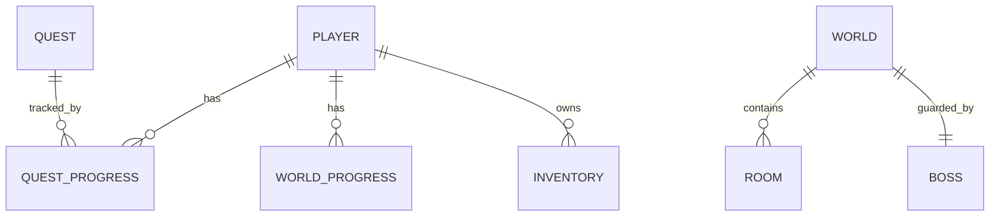

# Database Schema (Future Spring Boot & PostgreSQL)

Thiết kế này chuẩn bị sẵn cho Phase 5. Các thực thể (Entities) ở đây sẽ được map trực tiếp với JPA / Hibernate trong Spring Boot.

## 1. ERD (Entity Relationship Diagram)

## 2. Table Definitions

### Table: `players`
Lưu trữ thông tin cơ bản và các chỉ số (Statistics).
- `id` (UUID, PK)
- `username` (String, Unique)
- `password_hash` (String)
- `level` (Int)
- `xp` (Int)
- `gold` (Int)
- `current_world_id` (String, FK)
- `current_streak` (Int)
- `total_quests_completed` (Int)

### Table: `quests`
Định nghĩa (Definition) của các Quest, không thể thay đổi bởi user.
- `id` (String, PK)
- `title` (String)
- `type` (Enum: DAILY, WEEKLY, MAIN)
- `difficulty` (Enum: EASY, MEDIUM, HARD)
- `reward_xp` (Int)
- `reward_gold` (Int)

### Table: `quest_progress`
Tiến trình (Progress) làm Quest của một User cụ thể.
- `id` (UUID, PK)
- `player_id` (UUID, FK)
- `quest_id` (String, FK)
- `status` (Enum: IN_PROGRESS, COMPLETED, CLAIMED)
- `completed_at` (Timestamp)

### Table: `worlds`
- `id` (String, PK)
- `name` (String)
- `required_level` (Int)

### Table: `bosses`
- `id` (String, PK)
- `world_id` (String, FK)
- `name` (String)
- `max_hp` (Int)

### Table: `world_progress`
Lưu tiến trình diệt Boss và vượt World của người chơi.
- `id` (UUID, PK)
- `player_id` (UUID, FK)
- `world_id` (String, FK)
- `boss_current_hp` (Int)
- `is_cleared` (Boolean)
- `cleared_at` (Timestamp)

### Table: `inventories`
- `id` (UUID, PK)
- `player_id` (UUID, FK)
- `item_id` (String)
- `quantity` (Int)
